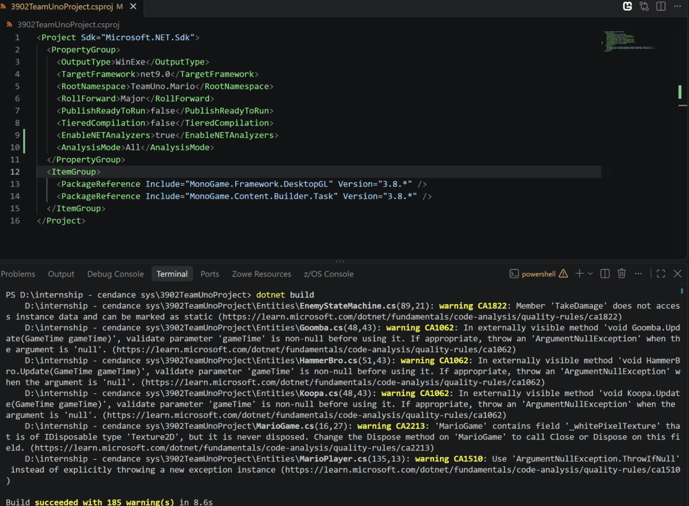
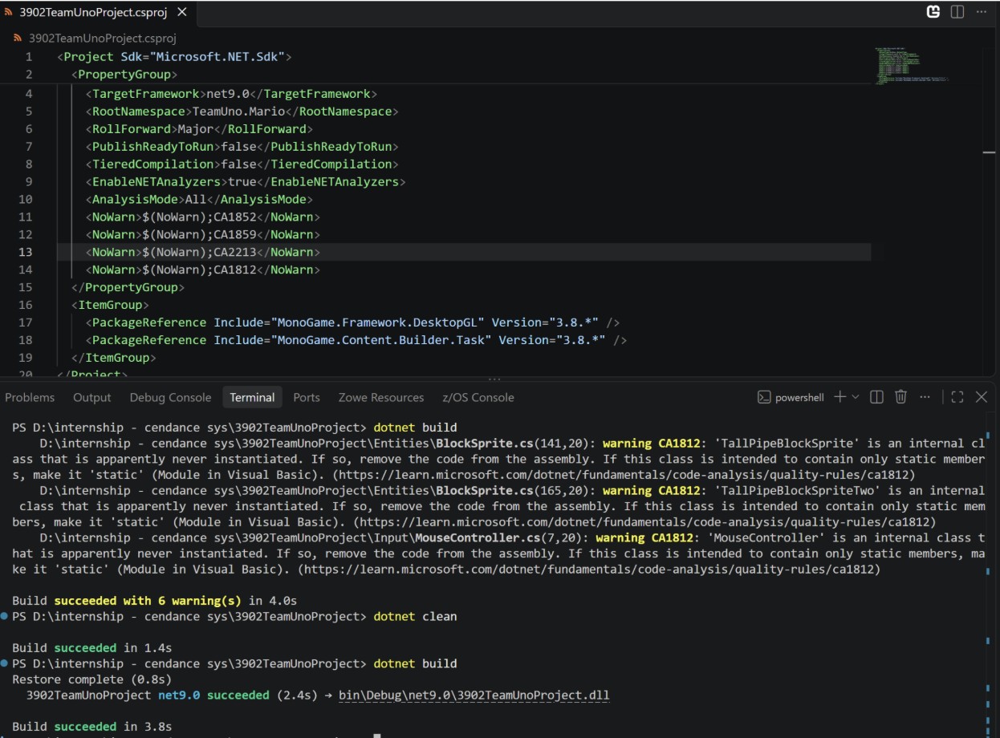

# .NET code analyzers (Roslyn)

All warnings have been fixed or suppressed. The ones that are suppressed would conflict with code structure and functionality for future sprints. The following is the list of fixes:

- **CA 1062 — Fix:** Because an application's API isn't typically referenced from outside the assembly, types can be made internal.
- **CA 1510 — Fix:** Use `ArgumentNullException.ThrowIfNull` instead of explicitly throwing a new exception instance.
- **CA 1822 — Fix:** Methods do not access instance data and can be marked as static.
- **CA 1512 — Fix:** Use `ArgumentOutOfRangeException.ThrowIfNegativeOrZero` instead of explicitly throwing a new exception instance.
- **CA 2213 — Suppress:** Fields in classes are of `IDisposable` type but are never disposed. The current code disposes of the field.
- **CA 1852 — Suppress:** A type that is not accessible outside its assembly and has no subtypes within its containing assembly is not marked sealed (`NotInheritable` in Visual Basic).
- **CA 1812 — Suppress:** A type that is not accessible outside its assembly and has no subtypes within its containing assembly is not marked sealed (`NotInheritable` in Visual Basic).

